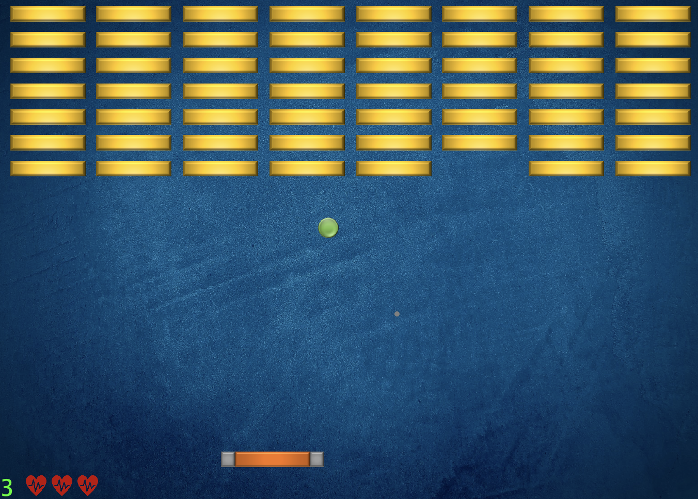
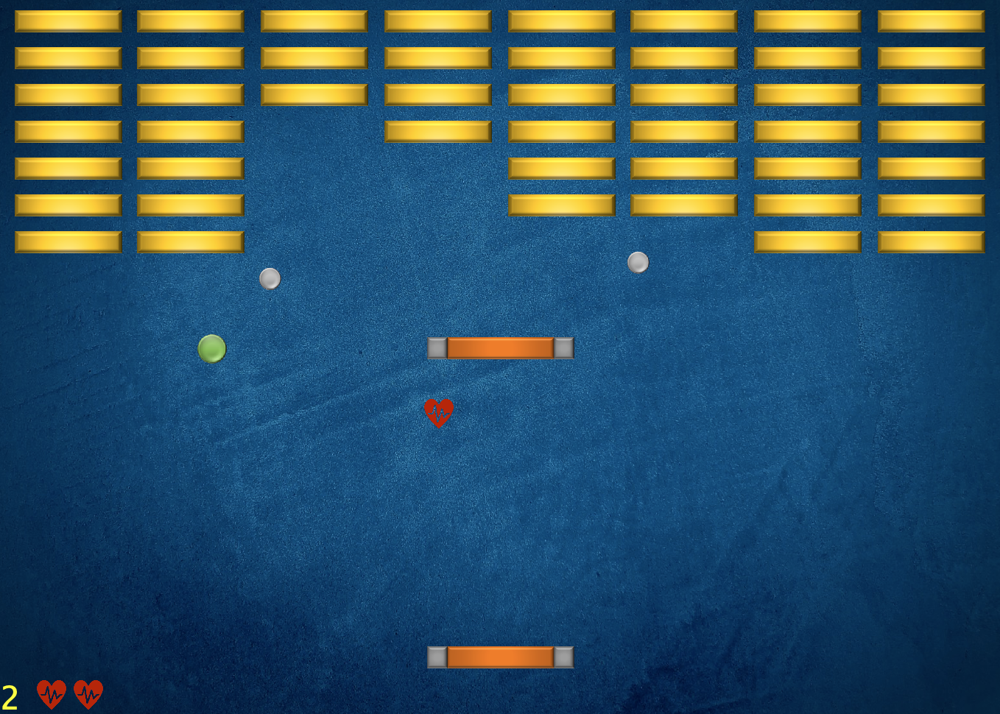
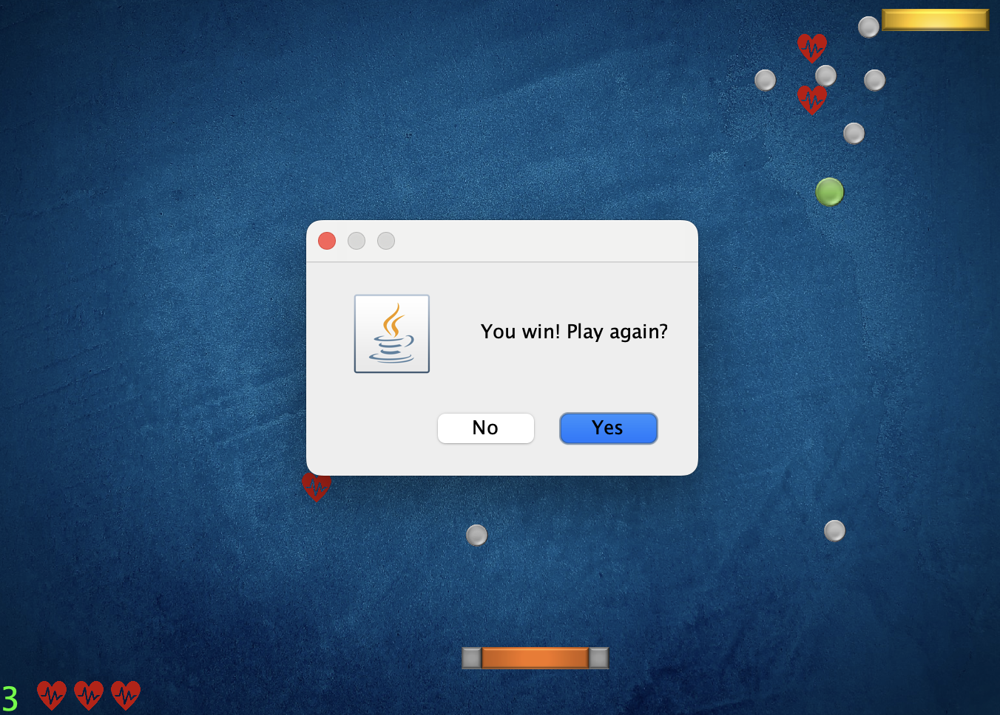

# Bricker Game

A fast-paced arcade game where the player controls a paddle to bounce a ball and break bricks.
The game world includes multiple brick types with different collision behaviors, creating varied challenges for the player.

  
  
  

## 🎮 How to Play

Before running the game, you need to add the **DanoGameLab** dependency:  
**File → Project Structure → Modules → Dependencies → DanoGameLab.jar**

Once added, run the main class to start the game.  
Collect power-ups, avoid losing the ball, and clear all bricks to win!
