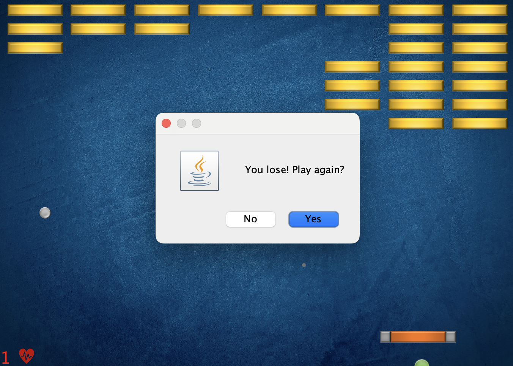

# Bricker Game

A classic **Breakout-style arcade game** built in Java.  
Control the paddle and destroy all the bricks to win! 

  
  
  
  

## 🎮 How to Play

Before running the game, you need to add the **DanoGameLab** dependency:  
**File → Project Structure → Modules → Dependencies → DanoGameLab.jar**

Once added, run the main class to start the game.  
Collect power-ups, avoid losing the ball, and clear all bricks to win!
